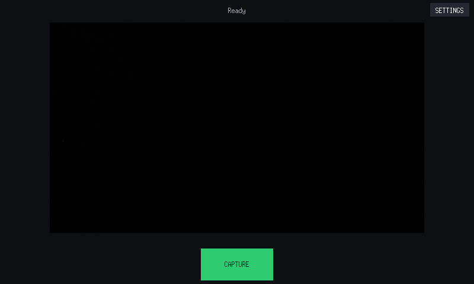
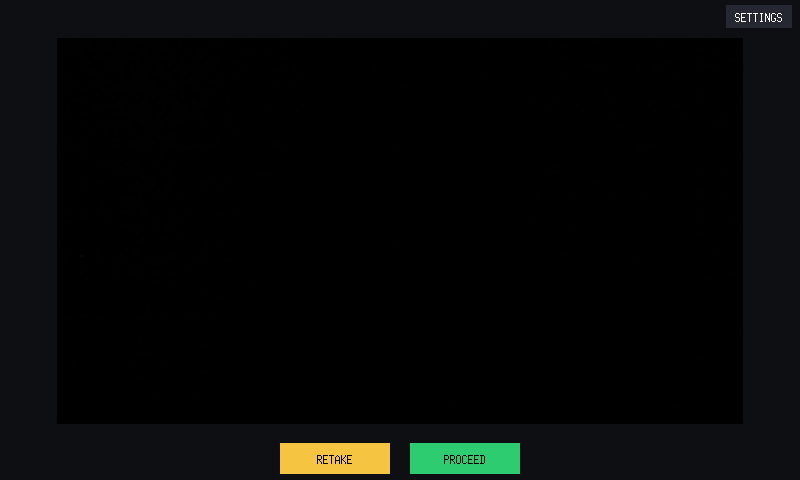
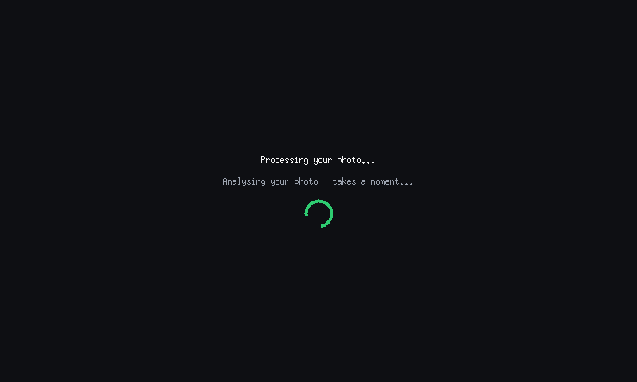
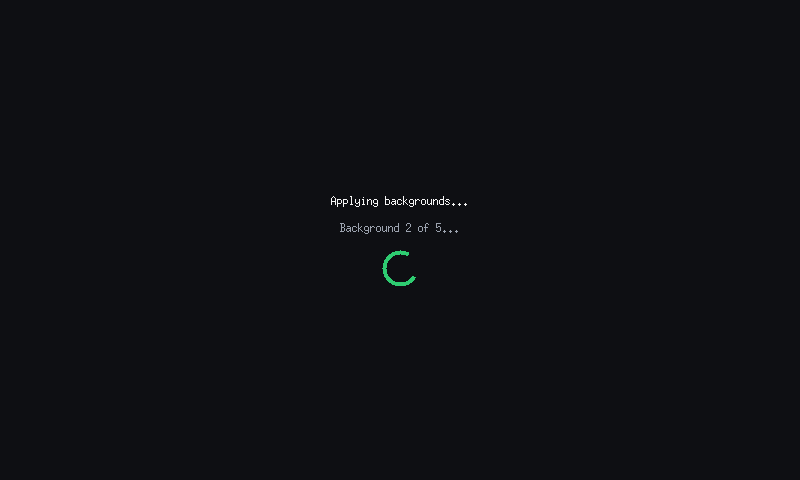
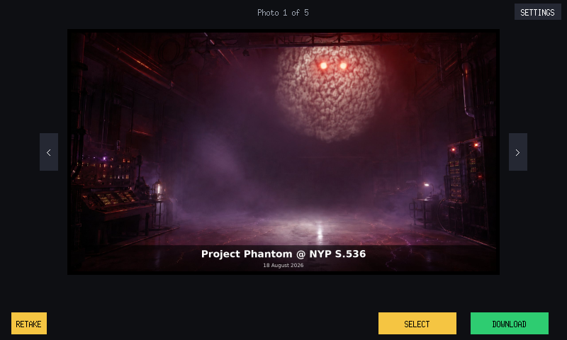
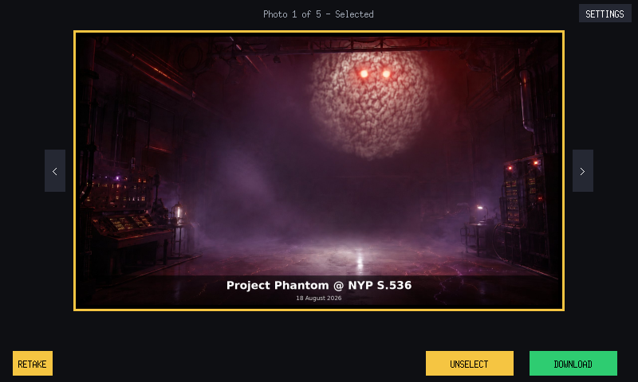
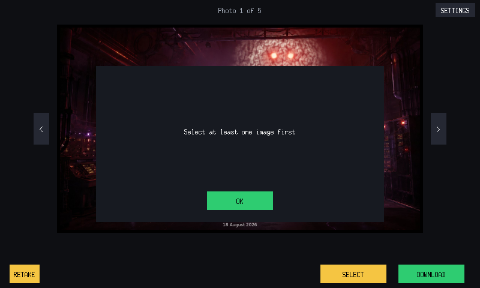
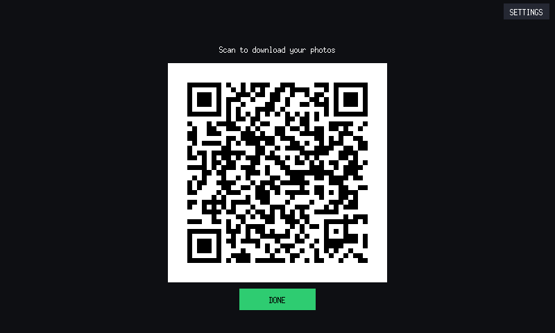
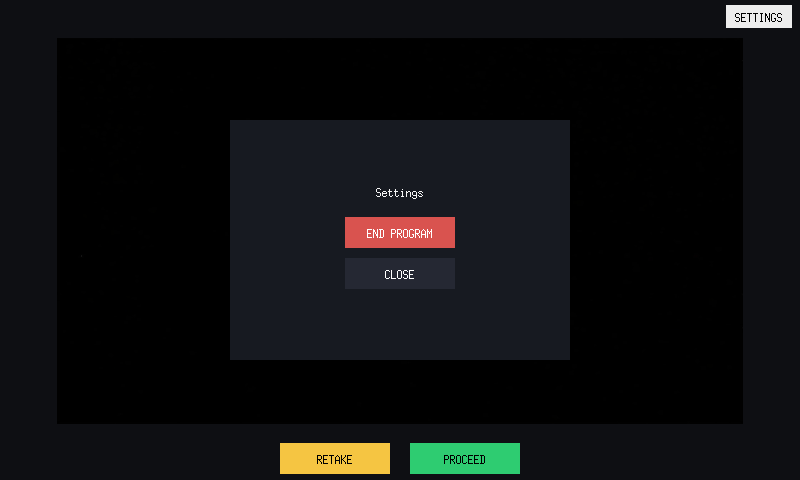

# UI Flow

[← Back to Software README](../README.md)

**Note: Camera covered for privacy reasons**

## 1. Live Preview

Continuous camera preview. Status text sits along the top of the screen. The
**CAPTURE** button stays disabled — showing an animated spinner instead —
until the camera is confirmed to be genuinely delivering frames, not just
"turned on" (see [camera-reliability.md](./camera-reliability.md) for why
that distinction matters). Pressing **CAPTURE** starts a 3-2-1-0 countdown
overlaid on the live feed, with a beep on each number; the photo is taken
automatically the moment it reaches zero, using a distinct capture sound
in place of a fourth beep.

## 2. Capture Review

Shows the just-captured photo before any processing happens, so the user
can catch an obviously bad shot early. **RETAKE** returns to the live
preview to try again — instantly, with no reload delay, since the camera
is deliberately kept running in the background through this whole screen
rather than being closed and reopened. **PROCEED** sends the photo into
the background-removal pipeline.

## 3. Processing

The first, unpredictable-duration stage: YOLO finds each person and
MediaPipe computes the background-removal mask (see
[pipeline-explained.md](./pipeline-explained.md) for the full pipeline).
Shown with an animated spinner, since this stage's duration can't be known
in advance — there are no progress bars anywhere in the app, a bar implies
a real percentage that doesn't genuinely exist here.

## 4. Applying Backgrounds

Once the mask above is computed, it's reused to composite the photo onto
every background template in turn — the mask itself is only calculated
once, not recalculated per template. Status text updates to "Background X
of Y" as each one completes, still with the same animated spinner.

## 5. Gallery

Every generated background variant, with:

- **Left/right arrows** to browse between templates
- Status text along the top showing position (e.g. "Photo 1 of 5")
- **Tap the photo itself, or the SELECT button**, to select it — the
  button dynamically relabels to **UNSELECT**, and tapping either the photo
  or the button again removes the selection
- **RETAKE** — in case the final composited result doesn't look good, not
  just the original photo (returns to live preview, discarding this
  session's output)
- **DOWNLOAD** — proceeds once at least one photo is selected

— a template shown in its selected state

— the popup shown if DOWNLOAD is pressed with nothing selected

## 6. Preparing Your Download

Only zips the selected photos if more than one was picked — a single
selected photo uploads directly, no zip step. Uploads via a persistent
`rclone` background service for speed, with an automatic fallback to a
slower-but-proven direct method if that service doesn't respond (see
[download-pipeline.md](./download-pipeline.md)). If that fallback kicks
in, a "taking longer than usual" message appears on this screen so it's
clear something is happening, not that the booth has frozen.

This step also depends on the Pi's system clock being genuinely correct —
see the time-sync note in [troubleshooting.md](./troubleshooting.md) if
this screen ever fails with a certificate/time-related error (the app
corrects the clock automatically at every startup, so this should be rare).

## 7. QR Download

Shows a QR code generated from the uploaded photo's share link. Scanning it
with a phone starts the download immediately — no shared Wi-Fi required.
**DONE** returns to the live preview screen.

Unlike earlier stages of this project, there's no timed auto-delete for the
uploaded copy — the local session folder is wiped automatically (see
[local-cleanup.md](./local-cleanup.md) for the full story, including a real
bug the old timer-based approach had), but the uploaded copy on Google Drive is left
in place and cleaned up manually rather than on a timer.

## Settings

A settings button appears on most screens. Opens a small popup with
**END PROGRAM** and **CLOSE** — intentionally minimal, since this is a
kiosk app with no user-facing configuration needed.