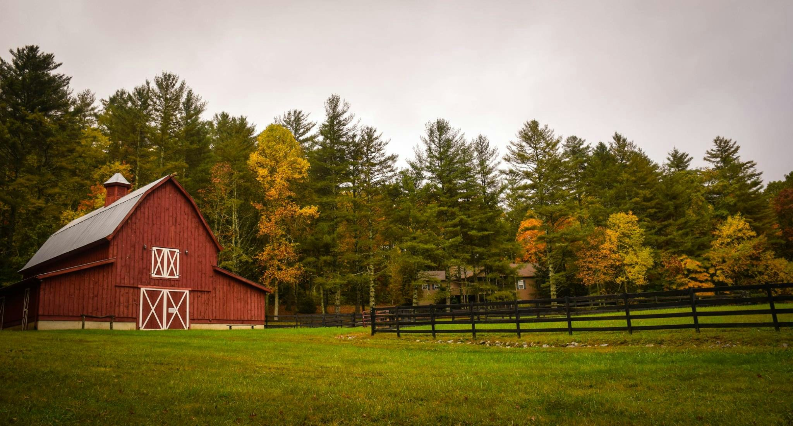

# Background Templates

[← Back to Software README](../README.md)

## Where they live

Background template images go in:

```
photobooth/assets/backgrounds/
```

Every image file in this folder is automatically loaded by the app at
startup and offered as a background option in the Gallery screen — there's
no code change needed to add or remove templates, just add or remove image
files in this folder.

## The templates used for this MVP

> - `beach.jpg` — 
> - `city.jpg` — 
> - `country.jpg` — 
> - `sunset.jpg` — 


## These can be changed to anything

The specific templates used for this MVP are not fixed requirements of the
system — any JPEG or PNG placed in `assets/backgrounds/` works. Recommended
for best results: reasonably high resolution (the app composites at
1920×1080), and avoid extremely busy/high-detail backgrounds if hair-edge
quality matters, since fine detail is naturally easier to see clearly
against a smoother background.
