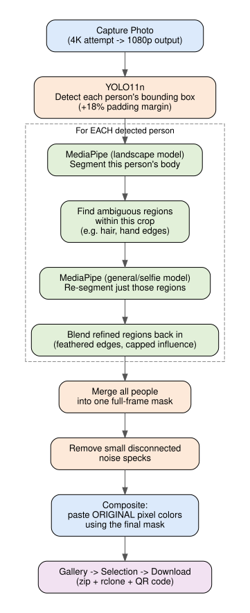

# The Background-Removal Pipeline, Explained

[← Back to Software README](../README.md)

## The problem this solves

A single AI segmentation model works well for one person, close to the
camera. It breaks down in two specific ways: **group photos**, and **fine
detail like hair**. Rather than one model trying to do everything, this
pipeline splits the job across tools based on what each is actually good at.

## The pipeline, step by step



Text version of the same flow:

```
Capture (4K attempt → 1080p output)
    ↓
YOLO11n → bounding box per person (detection only, +18% padding margin)
    ↓
For each person's crop:
    MediaPipe (landscape model) → soft body alpha
        ↓
    Find ambiguous sub-regions within that crop (hair, hand edges)
        ↓
    Each ambiguous region re-run through MediaPipe (general/selfie model)
        ↓
    Blended back in with feathered edges and a capped influence
    ↓
Merge all people into one full-frame mask
    ↓
Remove small disconnected noise specks
    ↓
Composite: paste ORIGINAL pixel colors directly using final alpha
```

## Why YOLO, and specifically why detection (not segmentation)

MediaPipe alone struggles with group photos because it's trained mostly on
close-up, single-person "selfie" framing — a wide 10-person shot is far
outside what it actually knows. YOLO11n finds each person's bounding box
first, which lets MediaPipe process each person as an individual close-up
crop instead of the whole wide scene at once.

Only the **detection** variant of YOLO is used (`yolo11n.pt`, not
`yolo11n-seg.pt`) — YOLO only needs to answer "where is each person," not
produce a precise silhouette. MediaPipe, tuned specifically for edge quality,
handles the actual masking once it has a clean, cropped view of one person.
A segmentation-capable YOLO model was tested and worked, but added real cost
(a heavier model, plus needing a separate matting step for hair quality) for
a job the lighter detection model already solves.

Each detected box is expanded by about 18% before cropping — a margin set by
observation during testing (what was getting clipped), not derived from a
formula — so hair sticking up past the top of the box, or feet at the
bottom, don't get cut off by a too-tight crop.

## Why two different MediaPipe configurations

MediaPipe's `SelfieSegmentation` has two settings tuned for different framing
distances:

- **Landscape** (`model_selection=1`) — tuned for a subject with more
  surrounding context. Used for each person's overall body mask.
- **General/selfie** (`model_selection=0`) — tuned for close, tightly-framed
  subjects. Used *only* to refine small regions where the landscape model's
  own confidence is ambiguous — mainly hair.

This split was decided from a direct A/B test on a real cropped photo: the
general model was noticeably better right at the hairline, but let more
background bleed through everywhere else on the body. That's the tradeoff
you'd expect — a more permissive model helps fine translucent detail but
hurts a confident, hard silhouette edge. Using landscape for the body and
confining general to only the small ambiguous regions gets the hair
improvement without paying that cost across the whole photo.

## Why the composite doesn't fade or shift color

The final image pastes the **original captured photo's pixel colors**
directly, using the computed alpha mask — no color re-estimation happens
anywhere. This was a deliberate choice after testing an approach (rembg's
built-in alpha matting) that *did* re-estimate colors in uncertain regions,
which caused the composited image to visibly fade depending on which
background template it was placed against. Direct pixel-paste avoids that
entirely.

## What was tried and rejected along the way

See [`dependencies.md`](./dependencies.md) for the short version. In brief:
reference-background subtraction (too fragile to camera auto-exposure
shifts, measured directly), rembg (best hair quality of anything tested, but
slow and gave inconsistent results on identical input), MediaPipe's
multiclass segmenter (best specifically at hair, but misclassified real
content like a shirt's printed graphic), and true alpha matting via
`pymatting` (a real, working technique, but could hang on numerically
unstable small regions — and testing showed the simpler two-MediaPipe-model
approach was equally good without that risk).
